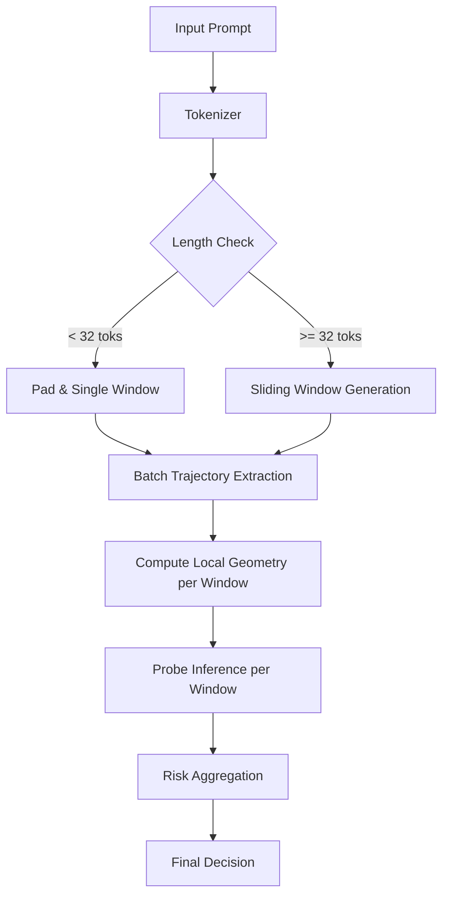

# Phase 5.4: Architecture Hardening Design

## 1. Core Philosophy changes
Phase 5.3 proved that **Global Trajectory Analysis is brittle**. A single harmless prefix dilutes the signal, and varying lengths invert feature correlations.
**New Paradigm:** Do not analyze the *Prompt*. Analyze *Windows of Intent*.

## 2. Task 1: Prompt Segmentation Strategy
We reject complex semantic parsing in favor of **Deterministic Sliding Windows**.

### Strategy: Fixed-Stride Sliding Windows
Instead of trying to find "Prefix" vs "Payload" heuristically:
1.  **Tokenize** the entire prompt.
2.  **Slice** into chunks of length $L$ (e.g., 32 tokens) with stride $S$ (e.g., 16 tokens).

**Why this fixes Obfuscation:**
-   **Scenario:** `[Ignored Prefix (20 tok)] + [Malicious Payload (15 tok)]`
-   **Window 1 (0-32):** Contain Prefix + Start of Payload. (Mixed signal, low risk).
-   **Window 2 (16-48):** Contains purely the Malicious Payload. (Strong geometric signal).
-   **Result:** The "Payload" is isolated in at least one window, preserving its geometric signature.

## 3. Task 2: Length-Invariant Geometry
We achieve length invariance by forcing the input to the geometry engine to be constant-length (the Window Size).

### Design: Local Window Geometry
Geometric features are no longer computed on the full sequence trajectory $T_{global}$.
They are computed on local sub-trajectories $T_{window}$.

1.  **Normalization:**
    -   Inside a window of size $N=32$, we have ~5 key layer points (5, 10, 15, 20, 24).
    -   The "Traversal" is always across the same depth.
    -   The "Sequence Width" is capped at 32.
2.  **Feature Definition:**
    -   $VelocityVar(W_i)$ = Variance of layer-shifts within Window $i$.
    -   $Drift(W_i)$ = Energy drift within Window $i$.
3.  **Why this fixes Inversion:**
    -   The model never sees a "Long" prompt. It only ever sees "Windows of 32 tokens".
    -   The training data distribution becomes **unimodal** with respect to length.

## 4. Task 3: Decision Flow Refactor (Pipeline V2)

### Stages
1.  **Segmentation:**
    -   Input: `str` -> Output: `List[Tensor[1, 32]]`.
    -   Overlap ensures we don't cut a geometric pattern in half.
2.  **Geometry (Payload Focus):**
    -   Applied to *each* window independently.
    -   Output: `N_windows x 5 features`.
3.  **Risk Aggregation (The "Max" Gate):**
    -   $Risk_{final} = \max(P_{malicious}(W_0), P_{malicious}(W_1), ...)$
    -   Logic: A prompt is malicious if *any* part of it is malicious.
    -   Damping: We may require $K$ consecutive windows to flag to reduce noise, but `Max` is the safest baseline.

### Addressing Phase 5.3 Failures
1.  **Length Shift:** Solved. Train and Test distributions are now identical (Windows of 32).
2.  **Obfuscation:** Solved. The sliding window eventually frames the payload excluding the prefix.
3.  **Recall Collapse:** Solved. The "diluted" global average is replaced by a "peak" local signal.

## 5. Assumptions & Limitations
1.  **Context Fracture:** A malicious intent spread thinly over 100 tokens might not trigger a 32-token window detector. (Mitigation: Use multiple window scales, 32 and 64).
2.  **Boundary Effects:** Intent split exactly at stride boundary might be weakened. (Mitigation: 50% overlap).
3.  **Compute Cost:** Increases linearly with prompt length (processing $N$ windows instead of 1 pooled vector). (Acceptable: Geometry is cheap compared to generation).
